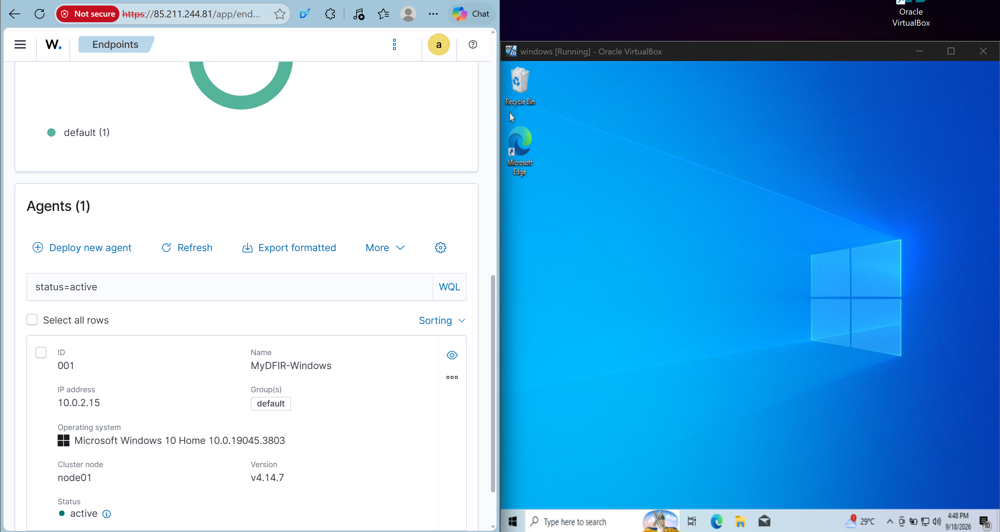
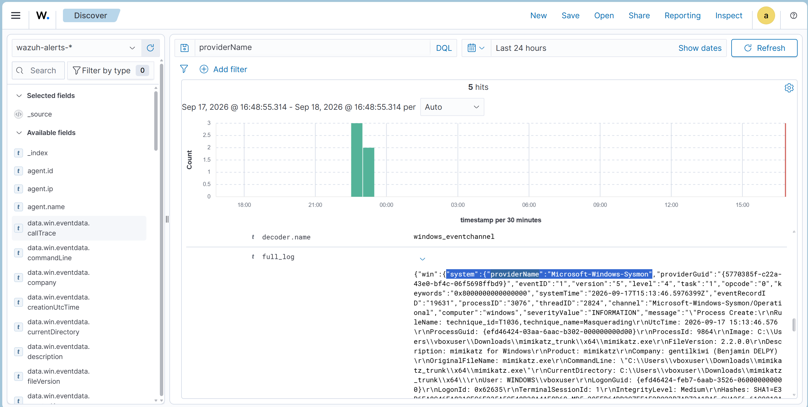
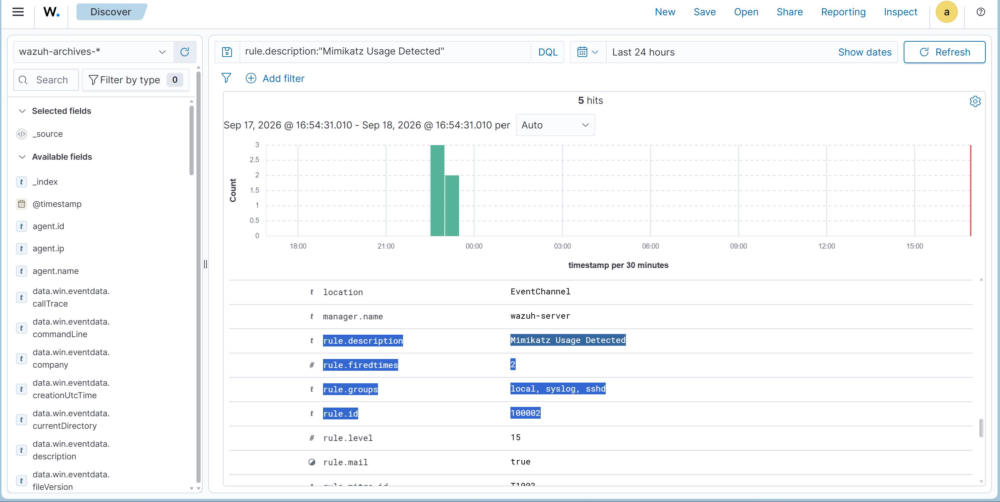
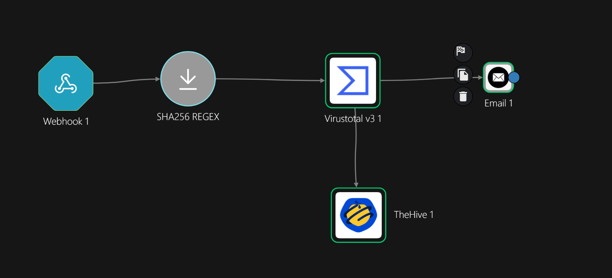
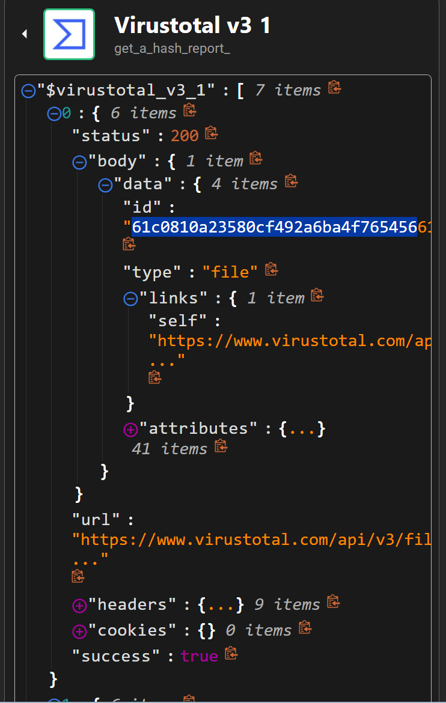
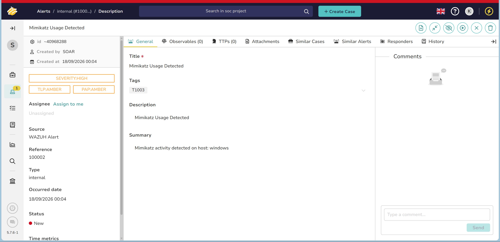
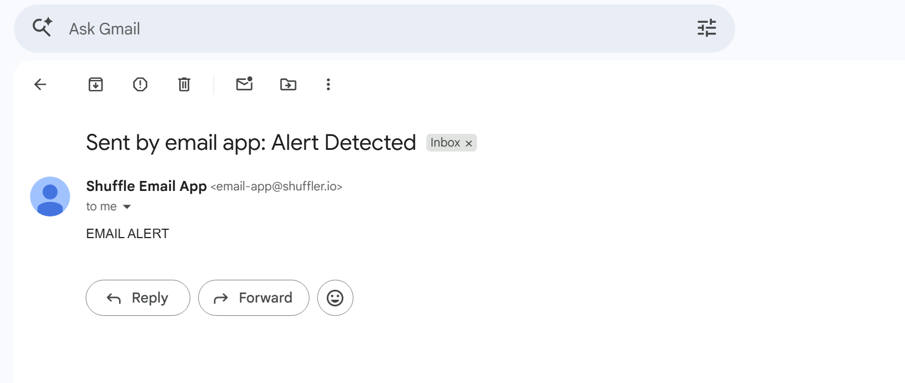

# SOC Automation Lab

End-to-end SOC automation lab integrating **Sysmon, Wazuh, Shuffle SOAR, VirusTotal, and TheHive** to detect suspicious Windows activity, enrich indicators, create investigation alerts, and notify a SOC analyst.

This project uses a controlled **Mimikatz detection scenario** to demonstrate a complete SOC workflow from endpoint telemetry collection to automated incident handling.

---

## Architecture


### Detection Pipeline

```text
Windows 10 VM
(Sysmon + Wazuh Agent)
        │
        │ Sysmon Telemetry
        ▼
Wazuh Manager
(Custom Detection Rule)
        │
        │ Mimikatz Detection
        ▼
Shuffle SOAR
        │
        ├── SHA256 Extraction
        │
        ▼
VirusTotal
        │
        │ Threat Intelligence Enrichment
        ▼
Shuffle
        │
        ├── Create Alert ─────► TheHive
        │
        └── Send Email ───────► SOC Analyst
```

The completed workflow follows a basic SOC process:

**Detect → Enrich → Investigate → Notify**

---

## Project Objectives

The goal of this project was to build a functional SOC environment capable of:

- Collecting Windows endpoint telemetry using Sysmon
- Forwarding endpoint logs to a centralized Wazuh SIEM
- Detecting suspicious process execution
- Creating a custom Wazuh detection rule
- Mapping detections to MITRE ATT&CK
- Forwarding high-severity alerts to Shuffle SOAR
- Extracting SHA256 indicators from security events
- Enriching file hashes using VirusTotal
- Automatically creating alerts in TheHive
- Sending email notifications to a SOC analyst

---

## Technologies Used

| Technology | Purpose |
|---|---|
| Microsoft Azure | Cloud infrastructure |
| Ubuntu Server | Wazuh and TheHive servers |
| Windows 10 | Monitored endpoint |
| Oracle VirtualBox | Local endpoint virtualization |
| Wazuh | SIEM, log analysis, and detection |
| Sysmon | Detailed Windows endpoint telemetry |
| Shuffle | SOAR and workflow automation |
| VirusTotal | Threat intelligence enrichment |
| TheHive | Alert and incident management |
| Elasticsearch / Wazuh Indexer | Security event indexing |
| Filebeat | Event forwarding |
| Cassandra | TheHive database backend |
| PowerShell | Windows administration and testing |
| MITRE ATT&CK | Detection technique mapping |
| Regex | SHA256 extraction |
| REST APIs | Platform integrations |

---

# 1. Azure Infrastructure

The cloud portion of the lab was deployed in **Microsoft Azure**.

Two Ubuntu virtual machines were created:

```text
Azure Resource Group
│
├── Wazuh Server
│   └── Ubuntu Server
│
└── TheHive Server
    └── Ubuntu Server
```

### Wazuh Server

The Wazuh VM hosts:

- Wazuh Manager
- Wazuh Dashboard
- Wazuh Indexer
- Filebeat
- Custom detection rules

### TheHive Server

The TheHive VM hosts:

- TheHive
- Cassandra
- Elasticsearch
- Java

Azure Network Security Groups were configured to control inbound traffic.

Important ports used during the lab:

| Port | Purpose |
|---|---|
| 22 | SSH |
| 443 | Wazuh Dashboard |
| 1514 | Wazuh agent communication |
| 1515 | Wazuh agent enrollment |
| 9000 | TheHive web/API interface |

---

# 2. Windows Endpoint Configuration

A Windows 10 virtual machine was created using **Oracle VirtualBox**.

The endpoint was configured with:

- Wazuh Agent
- Sysmon
- Windows Event Viewer
- PowerShell

The Wazuh agent was configured to communicate with the Wazuh Manager hosted in Azure.

Initially, the agent could not connect because Azure did not allow the required Wazuh ports.

Azure NSG rules were added for:

```text
TCP 1514 - Wazuh agent communication
TCP 1515 - Wazuh agent enrollment
```

Connectivity was tested from the Windows VM using:

```powershell
Test-NetConnection <WAZUH_SERVER> -Port 1514
Test-NetConnection <WAZUH_SERVER> -Port 1515
```

After restarting the Wazuh Agent service, the endpoint successfully appeared as **Active** in the Wazuh Dashboard.

### Wazuh Agent Connected



---

# 3. Sysmon Telemetry Collection

Sysmon was installed on the Windows VM to provide detailed endpoint telemetry.

The Wazuh Agent configuration was updated to collect the Sysmon Operational event channel:

```xml
<localfile>
  <location>Microsoft-Windows-Sysmon/Operational</location>
  <log_format>eventchannel</log_format>
</localfile>
```

The existing Windows Application, Security, and System event collection remained enabled.

Sysmon provided telemetry including:

- Process creation
- Process termination
- Process access
- Image and DLL loading
- File creation
- Registry activity
- Command-line arguments
- File hashes
- Parent process information

### Sysmon Telemetry in Wazuh



---

# 4. Wazuh Archive Logging

Wazuh was configured to archive all received events so that telemetry could still be investigated even if it did not trigger a detection rule.

The following settings were enabled in `ossec.conf`:

```xml
<logall>yes</logall>
<logall_json>yes</logall_json>
```

Archived events were stored in:

```text
/var/ossec/logs/archives/archives.json
```

Filebeat archive forwarding was also enabled:

```yaml
archives:
  enabled: true
```

A new Wazuh index pattern was created:

```text
wazuh-archives-*
```

This allowed raw Sysmon telemetry to be searched using Wazuh Discover.

---

# 5. Controlled Detection Simulation

A controlled **Mimikatz** execution was performed inside the isolated Windows VM.

The purpose was to generate realistic suspicious endpoint telemetry for detection engineering and SOC automation testing.

Sysmon successfully recorded activity associated with the executable.

Example telemetry included:

```text
Image:
C:\Users\<user>\Downloads\mimikatz_trunk\x64\mimikatz.exe

OriginalFileName:
mimikatz.exe

Product:
mimikatz
```

Sysmon produced multiple event types during testing, including:

```text
Event ID 1  - Process Create
Event ID 5  - Process Terminated
Event ID 7  - Image Loaded
Event ID 10 - Process Access
Event ID 11 - File Create
Event ID 15 - File Stream Create
```

---

# 6. Custom Wazuh Detection Rule

A custom Wazuh detection rule was created to detect Mimikatz execution using Sysmon Process Create telemetry.

```xml
<group name="sysmon,mimikatz,">

  <rule id="100002" level="15">
    <if_group>sysmon_event1</if_group>
    <field name="win.eventdata.originalFileName" type="pcre2">(?i)mimikatz\.exe</field>
    <description>Mimikatz Usage Detected</description>
    <mitre>
      <id>T1003</id>
    </mitre>
  </rule>

</group>
```

The rule:

- Monitors Sysmon Process Creation events
- Checks the executable's original filename
- Uses case-insensitive matching
- Generates a Level 15 Wazuh alert
- Maps the activity to MITRE ATT&CK **T1003 - OS Credential Dumping**

The rule successfully generated:

```text
Mimikatz Usage Detected

Rule ID: 100002
Rule Level: 15
MITRE ATT&CK: T1003
```

### Custom Mimikatz Detection



The sanitized detection rule is also included in:

```text
wazuh/local_rules.xml
```

---

# 7. Wazuh to Shuffle Integration

Wazuh was integrated with **Shuffle SOAR** using a webhook.

Only alerts generated by the custom Mimikatz detection rule were forwarded to the workflow.

Example configuration:

```xml
<integration>
  <name>shuffle</name>
  <hook_url>SHUFFLE_WEBHOOK_URL</hook_url>
  <rule_id>100002</rule_id>
  <alert_format>json</alert_format>
</integration>
```

The actual webhook URL is intentionally excluded from this repository.

When Wazuh Rule `100002` fires, Wazuh sends the alert JSON to Shuffle.

---

# 8. Shuffle SOAR Workflow

Shuffle was used to automate the response workflow.

The workflow performs the following actions:

```text
Wazuh Alert
    │
    ▼
Shuffle Webhook
    │
    ▼
SHA256 Regex Extraction
    │
    ▼
VirusTotal Hash Lookup
    │
    ├────────► TheHive Alert Creation
    │
    └────────► SOC Analyst Email Notification
```

### Shuffle Workflow



---

# 9. SHA256 Extraction

The Wazuh alert contains several file hash formats.

Shuffle was configured to extract the SHA256 value using a regex capture group.

```regex
SHA256=([0-9A-Fa-f]{64})
```

The extracted hash was then passed to VirusTotal for threat intelligence enrichment.

During testing, the regex action returned an object containing values such as:

```text
success
group_0
found
```

Initially, the entire regex result object was passed to VirusTotal, which resulted in an invalid lookup.

The workflow was corrected to pass only the extracted SHA256 value.

---

# 10. VirusTotal Threat Intelligence Enrichment

The extracted SHA256 hash was automatically submitted to VirusTotal.

Shuffle used the VirusTotal action:

```text
GET - Get a hash report
```

A successful request returned:

```text
HTTP 200
```

This stage allows the workflow to automatically enrich the detected indicator without requiring the analyst to manually search VirusTotal.

### VirusTotal Enrichment



---

# 11. TheHive Integration

TheHive was deployed on a separate Azure Ubuntu VM.

A dedicated **SOAR service account** was created in TheHive.

API key authentication was enabled so Shuffle could interact with the TheHive API.

Shuffle uses the:

```text
Create Alert
```

action to generate an investigation alert automatically.

Example alert body:

```json
{
  "description": "$exec.title",
  "flag": false,
  "pap": 2,
  "severity": "$exec.severity",
  "source": "$exec.pretext",
  "sourceRef": "$exec.rule_id-$exec.id",
  "status": "New",
  "summary": "Mimikatz activity detected on host: $exec.text.win.system.computer",
  "tags": ["T1003"],
  "title": "$exec.title",
  "tlp": 2,
  "type": "internal"
}
```

TheHive successfully accepted the automated request:

```text
POST /api/v1/alert

HTTP 201 Created
```

### TheHive Alert



The generated alert included information such as:

```text
Title: Mimikatz Usage Detected
Severity: High
Source: WAZUH Alert
MITRE ATT&CK: T1003
Status: New
Host: windows
```

---

# 12. SOC Analyst Email Notification

The final stage of the Shuffle workflow sends an email notification to the SOC analyst.

This ensures that the detection does not remain only inside the SIEM or case management platform.

The analyst is automatically notified that suspicious activity was detected and that an investigation alert was created.

### Email Notification



---

# Final SOC Automation Workflow

The completed pipeline is:

```text
Mimikatz Execution
        │
        ▼
Sysmon
        │
        ▼
Wazuh Agent
        │
        ▼
Wazuh Manager
        │
        ▼
Custom Rule 100002
        │
        ▼
Shuffle Webhook
        │
        ▼
SHA256 Extraction
        │
        ▼
VirusTotal Enrichment
        │
        ▼
TheHive Alert Creation
        │
        ▼
SOC Analyst Email Notification
```

This demonstrates a basic:

```text
Detect → Enrich → Investigate → Notify
```

SOC workflow.

---

# Troubleshooting and Lessons Learned

A large part of this project involved troubleshooting communication between multiple systems.

## Azure Region Restrictions

The Azure student subscription initially prevented VM deployment in some regions.

The Azure `allowedLocations` policy was inspected and the environment was deployed in an allowed region.

This provided experience working with Azure subscription policies and regional VM availability.

---

## SSH Private Key Permissions

SSH initially rejected the Azure `.pem` private key because Windows permissions allowed additional users/groups to access the file.

Windows ACL permissions were adjusted so that only the intended account could access the private SSH key.

This provided practical experience with:

- SSH keys
- Windows ACLs
- File permissions
- Secure remote administration

---

## Azure Networking

The Windows Wazuh agent initially could not communicate with the Wazuh Manager because Azure NSG rules did not allow the required ports.

Connectivity was verified using:

```powershell
Test-NetConnection <WAZUH_SERVER> -Port 1514
Test-NetConnection <WAZUH_SERVER> -Port 1515
```

This helped isolate networking problems between:

```text
Windows VM
    ↓
Home Network
    ↓
Internet
    ↓
Azure NSG
    ↓
Wazuh Manager
```

---

## HTTP vs HTTPS

The Wazuh Dashboard initially appeared inaccessible from the Windows VM when only the server IP was entered into the browser.

Explicitly using:

```text
https://<WAZUH_SERVER>
```

correctly connected to the Wazuh Dashboard over TCP 443.

This reinforced the relationship between:

```text
HTTP  → TCP 80
HTTPS → TCP 443
```

---

## Linux Permissions

Several Wazuh directories required elevated privileges.

For example:

```bash
sudo tail -f /var/ossec/logs/archives/archives.json
```

was required to inspect archived events.

This also reinforced the difference between commands that can be executed with `sudo` and shell built-ins such as `cd`.

---

## Wazuh Discover Time Range

One of the most important troubleshooting lessons occurred when Mimikatz telemetry existed in the backend but Wazuh Discover displayed:

```text
No Results
```

The ingestion pipeline was initially suspected.

However, the events were successfully verified inside:

```text
/var/ossec/logs/archives/archives.json
```

The Wazuh Indexer was then queried directly and confirmed that the Mimikatz events were already indexed.

The actual problem was the **Discover time range**.

The selected time range did not include the timestamps of the generated events.

This demonstrated an important SIEM troubleshooting principle:

> **No search results does not necessarily mean no logs were collected.**

When troubleshooting missing SIEM events, verify:

- Index / data source
- Time range
- Time zone
- Query
- Filters
- Raw event ingestion
- Indexer storage

---

## Wazuh Indexer Verification

The Wazuh archive index was queried directly to confirm that archived events were being stored.

The archive contained thousands of documents and more than one hundred Mimikatz-related events during testing.

This confirmed that:

```text
Sysmon
   ↓
Wazuh Agent
   ↓
Wazuh Manager
   ↓
archives.json
   ↓
Filebeat
   ↓
Wazuh Indexer
```

was functioning correctly.

---

## Shuffle Rule ID Configuration

The initial Wazuh-to-Shuffle integration used an incorrect Wazuh Rule ID.

Because the Rule ID did not exactly match the custom detection rule, Shuffle did not receive the expected Mimikatz alert.

After correcting the integration to use:

```text
100002
```

and restarting Wazuh, the webhook successfully received the alert.

---

## Shuffle Variable Handling

The SHA256 extraction action returned a structured object rather than only a single hash value.

Passing the entire object into VirusTotal resulted in an unsuccessful lookup.

The workflow was corrected to pass only the extracted SHA256 value.

This provided practical experience handling structured JSON data inside a SOAR workflow.

---

## Shuffle to TheHive Networking

TheHive port `9000` was originally restricted to the administrator's public IP using an Azure NSG.

Because Shuffle Cloud originates from a different network, the request timed out.

Temporarily allowing Shuffle access to port `9000` changed the error from:

```text
Timeout
```

to:

```text
HTTP 401 Authentication failure
```

This confirmed that the networking layer had been fixed and that authentication was the next issue.

---

## TheHive API Authentication

After network connectivity was established, TheHive returned:

```text
401 Authentication failure
```

API key authentication was verified in TheHive.

The correct SOAR service account API key was then configured in Shuffle.

The final result was:

```text
HTTP 201 Created
```

confirming that Shuffle successfully authenticated and created the TheHive alert.

---

## Resource Optimization

The TheHive Azure VM had limited memory available because Elasticsearch and Cassandra both run on Java.

Elasticsearch initially consumed several gigabytes of heap memory.

The Elasticsearch heap was tuned for the lab environment to reduce memory usage and leave enough resources for:

```text
Cassandra
Elasticsearch
TheHive
Ubuntu
```

This provided practical experience troubleshooting Linux memory utilization and JVM heap configuration.

---

# Skills Demonstrated

## Security Operations

- SIEM monitoring
- Endpoint telemetry
- Threat detection
- Threat hunting
- IOC enrichment
- Incident management
- Alert escalation
- SOAR automation

## Detection Engineering

- Sysmon
- Wazuh custom rules
- Windows Event Logs
- MITRE ATT&CK mapping
- Regex
- Process telemetry
- Detection validation

## Cloud and Networking

- Microsoft Azure
- Azure Network Security Groups
- Cloud virtual machines
- TCP/IP
- Firewall rules
- Public/private connectivity
- Port troubleshooting

## Systems Administration

- Ubuntu Linux
- Windows 10
- SSH
- systemd
- File permissions
- Windows ACLs
- Service management
- JVM memory tuning

## Integration and Automation

- REST APIs
- JSON
- XML
- Webhooks
- API keys
- VirusTotal
- TheHive
- Shuffle SOAR

---

# Security Considerations

This environment was created for educational and defensive cybersecurity purposes.

Sensitive information is intentionally excluded from this repository.

The following should **never** be committed to GitHub:

```text
API keys
Passwords
Shuffle webhook URLs
SSH private keys
Session cookies
Authentication tokens
Azure credentials
```

The project used some temporary configurations while building and testing the environment.

For example, TheHive TCP port `9000` was temporarily made publicly reachable so that Shuffle Cloud could communicate with the API.

This configuration is acceptable for temporary lab testing but should **not** be considered a production deployment.

---

# Future Improvements

Potential improvements include:

- Configure HTTPS for TheHive
- Place TheHive behind an Nginx reverse proxy
- Remove direct public exposure of TCP 9000
- Deploy a private Shuffle runtime
- Further restrict Azure NSG rules
- Store integration secrets using secure secret management
- Improve the Mimikatz detection beyond filename matching
- Detect renamed credential dumping tools
- Add hash-based detection
- Add behavioral detection rules
- Add additional MITRE ATT&CK detections
- Automatically add observables to TheHive
- Include VirusTotal enrichment results directly inside TheHive alerts
- Add additional Windows endpoints
- Create additional Wazuh dashboards
- Implement controlled automated response actions

---

# Key Takeaways

This project demonstrated how individual cybersecurity technologies can be connected into a functional SOC workflow.

Rather than simply installing security tools, the project integrated them into an end-to-end pipeline:

```text
Collect telemetry
      ↓
Detect suspicious behavior
      ↓
Generate SIEM alert
      ↓
Extract IOC
      ↓
Enrich IOC
      ↓
Create investigation alert
      ↓
Notify SOC analyst
```

The project also reinforced the importance of troubleshooting security infrastructure layer-by-layer.

Instead of assuming that a missing dashboard event meant telemetry was lost, each layer of the pipeline was independently verified:

```text
Endpoint
   ↓
Sysmon
   ↓
Wazuh Agent
   ↓
Wazuh Manager
   ↓
Archive Logs
   ↓
Filebeat
   ↓
Indexer
   ↓
Dashboard
```

This troubleshooting approach helped identify issues involving networking, permissions, indexing, time ranges, API authentication, and workflow configuration.

---

# Repository Structure

```text
soc-automation-lab/
│
├── README.md
├── LICENSE
│
├── screenshots/
│   ├── 00-architecture.png
│   ├── 01-wazuh-agent-active.png
│   ├── 02-sysmon-telemetry.png
│   ├── 03-mimikatz-detection.png
│   ├── 04-shuffle-workflow.png
│   ├── 05-virustotal-enrichment.png
│   ├── 06-thehive-alert.png
│   └── 07-email-notification.png
│
├── wazuh/
│   └── local_rules.xml
│
└── docs/
    └── architecture.md
```

---

## Disclaimer

This project was performed inside an isolated lab environment for cybersecurity education and defensive security testing.

All testing was performed against systems owned and controlled by the author.
