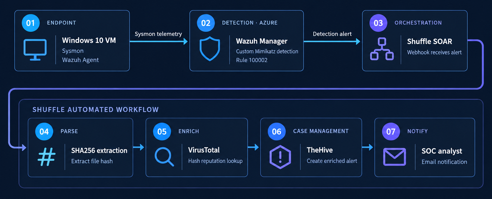

# SOC Automation Lab Architecture

## Overview

This project implements an end-to-end SOC automation workflow using:

- Windows 10
- Sysmon
- Wazuh
- Shuffle SOAR
- VirusTotal
- TheHive
- Microsoft Azure

The environment collects Windows endpoint telemetry, detects suspicious activity, enriches indicators using threat intelligence, creates an investigation alert, and notifies a SOC analyst.

---

## Architecture Diagram



---

## Detection Workflow

```text
Windows 10 VM
(Sysmon + Wazuh Agent)
        │
        │ Sysmon Telemetry
        ▼
Wazuh Manager
(Azure Ubuntu VM)
        │
        │ Custom Detection Rule 100002
        ▼
Shuffle SOAR
        │
        │ SHA256 Extraction
        ▼
VirusTotal
        │
        │ Threat Intelligence Enrichment
        ▼
Shuffle
        │
        ├────────► TheHive Alert
        │
        └────────► SOC Analyst Email
```

---

## Components

### Windows 10 Endpoint

The Windows 10 virtual machine acts as the monitored endpoint.

Installed components:

- Sysmon
- Wazuh Agent
- PowerShell
- Windows Event Viewer

Sysmon generates detailed endpoint telemetry including process creation, file hashes, process access, and image loading events.

The Wazuh Agent forwards Windows and Sysmon events to the Wazuh Manager.

---

### Wazuh Manager

Wazuh is hosted on an Ubuntu virtual machine in Microsoft Azure.

Wazuh is responsible for:

- Receiving endpoint telemetry
- Parsing Windows and Sysmon events
- Storing searchable security events
- Running custom detection rules
- Generating security alerts
- Forwarding selected alerts to Shuffle

A custom Wazuh rule detects Mimikatz execution and generates a Level 15 alert.

---

### Shuffle SOAR

Shuffle is used to automate the alert-handling workflow.

When Wazuh Rule `100002` fires, Wazuh sends the alert to a Shuffle webhook.

Shuffle then:

1. Receives the Wazuh alert
2. Extracts the SHA256 hash
3. Sends the hash to VirusTotal
4. Creates an alert in TheHive
5. Sends an email notification to the SOC analyst

---

### VirusTotal

VirusTotal provides threat intelligence enrichment.

The SHA256 value extracted from the Wazuh alert is sent to the VirusTotal API.

This allows the workflow to automatically retrieve information about the detected file hash.

---

### TheHive

TheHive is hosted on a separate Ubuntu virtual machine in Microsoft Azure.

TheHive is used for alert and incident management.

Shuffle communicates with TheHive using a dedicated SOAR service account and API key.

When the automation runs successfully, a new TheHive alert is created containing information such as:

- Detection title
- Severity
- Host
- Wazuh Rule ID
- MITRE ATT&CK technique
- Detection summary

---

## Network Communication

| Port | Service | Purpose |
|---|---|---|
| 22 | SSH | Linux server administration |
| 443 | Wazuh | Wazuh Dashboard |
| 1514 | Wazuh | Agent communication |
| 1515 | Wazuh | Agent enrollment |
| 9000 | TheHive | Web interface and API |

Azure Network Security Groups were used to control access to the cloud-hosted services.

---

## Detection Flow

The completed SOC workflow follows:

```text
Collect
   ↓
Detect
   ↓
Enrich
   ↓
Investigate
   ↓
Notify
```

This lab demonstrates how SIEM, endpoint telemetry, SOAR, threat intelligence, and incident management tools can work together in a SOC environment.
